# Unicode Nushu List / Unicode 女书一览表

Version / 版本：20180528

If you cannot see the Nushu charcater, please download the font TH-Tshyn-P1 in TH-Fonts. / 如果您看不到女书字符，请安装天珩全字库中的 TH-Tshyn-P1 字体。

{:nushu: style="font-family: TH-Tshyn-P1;"}

| 序号 | Unicode 编码 | 女书字符 | 图片 | 《字帖》序 | 对应汉字 | 江永方言代表发音 | 备注 |
| :-: | :-: | :-: | :-: | :-: | :- | :- | :- |
| 0 | U+01b170 | {::nushu}𛅰{:/nushu} |  | 0 | 一 | i5 |  |
| 1 | U+01b171 | 𛅱 |  | 1 | 两日入二 | na33 |  |
| 2 | U+01b172 | 𛅲 |  | 2 | 傺错七 | tsha5 |  |
| 3 | U+01b173 | 𛅳 |  | 3 | 人 | ie21 |  |
| 4 | U+01b174 | 𛅴 | 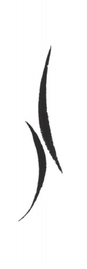 | 4 | 八 | poe5 |  |
| 5 | U+01b175 | 𛅵 |  | 5 | 十事实侍拾莳是誓 | swe33 |  |
| 6 | U+01b176 | 𛅶 |  | 6 | 标蜂漂飘批披喷片骗 | phiu44 |  |
| 7 | U+01b177 | 𛅷 |  | 7 | 约雨宇羽舞屋武 | u5 |  |
| 8 | U+01b178 | 𛅸 |  | 8 | 水 | cya35 |  |
| 9 | U+01b179 | 𛅹 |  | 9 | 了礼弟帝吊调丫 | tie42 |  |
| 10 | U+01b17a | 𛅺 |  | 10 | 内义要语宜仪谊议意遗蚁以认忍耳 | njie33 |  |
| 11 | U+01b17b | 𛅻 |  | 11 | 大代袋待怠台抬 | toe33 |  |
| 12 | U+01b17c | 𛅼 |  | 12 | 尺嘱烛却 | tchye5 |  |
| 13 | U+01b17d | 𛅽 |  | 13 | 下吓化 | fwe13 |  |
| 14 | U+01b17e | 𛅾 |  | 14 | 朝犁低刁雕 | liu44 |  |
| 15 | U+01b17f | 𛅿 | 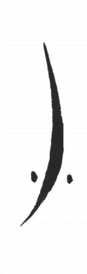 | 15 | 小细笑洗息夕削叔送宋宿 | siu35 |  |
| 16 | U+01b180 | 𛆀 |  | 16 | 土 | thu35 |  |
| 17 | U+01b181 | 𛆁 |  | 17 | 女 | njyu13 |  |
| 18 | U+01b182 | 𛆂 |  | 18 | 文闻 | vai42 |  |
| 19 | U+01b183 | 𛆃 |  | 19 | 坑间工公跟竿功更根庚耕 | kai44 |  |
| 20 | U+01b184 | 𛆄 |  | 20 | 寸可靠壳扩考介戒界狗苟稿确 | khau21 |  |
| 21 | U+01b185 | 𛆅 | 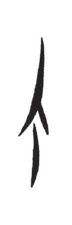 | 21 | 界介顾个告够过 | kou21 |  |
| 22 | U+01b186 | 𛆆 |  | 22 | 者九久韭酒守 | tciou35 |  |
| 23 | U+01b187 | 𛆇 |  | 23 | 两二 | liang35 |  |
| 24 | U+01b188 | 𛆈 | 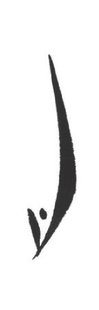 | 24 | 向上食 | ciang13 |  |
| 25 | U+01b189 | 𛆉 |  | 25 | 干千签迁 | tsheng44 |  |
| 26 | U+01b18a | 𛆊 |  | 26 | 三 | song44 |  |
| 27 | U+01b18b | 𛆋 |  | 27 | 没 | ma5 |  |
| 28 | U+01b18c | 𛆌 |  | 29 | 辉挥坏灰非飞饭翻番反费虽 | fa44 |  |
| 29 | U+01b18d | 𛆍 |  | 28 | 知泪虑立利粒单丹 | la44 |  |
| 30 | U+01b18e | 𛆎 |  | 31 | 太 | thoe21 |  |
| 31 | U+01b18f | 𛆏 |  | 32 | 才财裁 | tsoe42 |  |
| 32 | U+01b190 | 𛆐 |  | 33 | 蝦括骨刮发 | fwe44 |  |
| 33 | U+01b191 | 𛆑 |  | 34 | 此翅池子只纸指旨紫趾仔崽 | tswe35 |  |
| 34 | U+01b192 | 𛆒 |  | 35 | 称曾了拉弄弟刀动低洞第得灯登滴冻凳待带铜腾替驼潭 | ti13 |  |
| 35 | U+01b193 | 𛆓 |  | 36 | 戏习世势逝 | ci21 |  |
| 36 | U+01b194 | 𛆔 |  | 37 | 夫傅 | fu44 |  |
| 37 | U+01b195 | 𛆕 |  | 38 | 补火幅府妇 | fu35 |  |
| 38 | U+01b196 | 𛆖 |  | 39 | 贺祸户互父妇负富腐咐付赋附福服伏 | fu13 |  |
| 39 | U+01b197 | 𛆗 |  | 40 | 主煮矩举 | tcyu35 |  |
| 40 | U+01b198 | 𛆘 |  | 41 | 嘴句 | tcyu21 |  |
| 41 | U+01b199 | 𛆙 |  | 42 | 扮婚昏魂患纷分封坟份粉粪风睡 | fai44 |  |
| 42 | U+01b19a | 𛆚 |  | 43 | 口考肯好候 | hau35 |  |
| 43 | U+01b19b | 𛆛 |  | 44 | 斗抖到 | lou35 |  |
| 44 | U+01b19c | 𛆜 |  | 45 | 六略 | liou33 |  |
| 45 | U+01b19d | 𛆝 |  | 46 | 筹抽昼州周洲咒交旧娇绞教救较究舅纠求球丘 | tciou44 |  |
| 46 | U+01b19e | 𛆞 |  | 47 | 丑手首守 | ciou35 |  |
| 47 | U+01b19f | 𛆟 |  | 48 | 串劝 | tchyn21 |  |
| 48 | U+01b1a0 | 𛆠 | 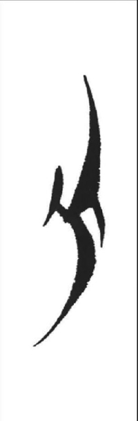 | 49 | 方芳风封丰妨逢凤番翻 | fang44 |  |
| 49 | U+01b1a1 | 𛆡 |  | 50 | 亡忘 | vang42 |  |
| 50 | U+01b1a2 | 𛆢 |  | 51 | 葬算丧蒜 | sang33 |  |
| 51 | U+01b1a3 | 𛆣 |  | 52 | 看炕靠叩扣孔勘砍扛杠贯杆干 | khang21 |  |
| 52 | U+01b1a4 | 𛆤 |  | 54 | 天汤通贪 | theng44 |  |
| 53 | U+01b1a5 | 𛆥 |  | 53 | 年侬然燃 | neng44 |  |
| 54 | U+01b1a6 | 𛆦 |  | 55 | 并兵变豹朝井平瓶拼聘桥茄其奇棋 | piong13 |  |
| 55 | U+01b1a7 | 𛆧 |  | 56 | 赢园元圆源缘原员援院愿荣王完玩 | iong42 |  |
| 56 | U+01b1a8 | 𛆨 |  | 57 | 味位未谓为万湾弯威卫 | va33 |  |
| 57 | U+01b1a9 | 𛆩 |  | 30 | 亏垮屈 | khua44 |  |
| 58 | U+01b1aa | 𛆪 |  | 58 | 吹 | tchya33 |  |
| 59 | U+01b1ab | 𛆫 |  | 60 | 内嫩 | nie33 |  |
| 60 | U+01b1ac | 𛆬 |  | 61 | 处对兑队堆顿凳 | lie21 |  |
| 61 | U+01b1ad | 𛆭 |  | 62 | 真针珍贞斟征金今襟斤巾筋惊徽沈 | tcie44 |  |
| 62 | U+01b1ae | 𛆮 |  | 63 | 称 | tchie44 |  |
| 63 | U+01b1af | 𛆯 |  | 64 | 个夜亦要 | njie44 |  |
| 64 | U+01b1b0 | 𛆰 |  | 65 | 泥银吟 | njie42 |  |
| 65 | U+01b1b1 | 𛆱 |  | 66 | 吃系音阴因姻殷忆与裕依医衣要以已孕荫于妖腰语药叶易应遗喻瑜幼意任如儒污 | ie44 |  |
| 66 | U+01b1b2 | 𛆲 |  | 67 | 吃任 | ie33 |  |
| 67 | U+01b1b3 | 𛆳 |  | 68 | 不未 | mwe13 |  |
| 68 | U+01b1b4 | 𛆴 |  | 71 | 会丫约要曰 | vwe33 |  |
| 69 | U+01b1b5 | 𛆵 |  | 69 | 划压鸭 | vwe5 |  |
| 70 | U+01b1b6 | 𛆶 |  | 70 | 他曲 | twe33 |  |
| 71 | U+01b1b7 | 𛆷 |  | 72 | 之滋支 | tswe44 |  |
| 72 | U+01b1b8 | 𛆸 |  | 73 | 匙时 | swe42 |  |
| 73 | U+01b1b9 | 𛆹 |  | 74 | 赐士是氏仕十事实侍师诗尸狮视市示史 | swe13 |  |
| 74 | U+01b1ba | 𛆺 | 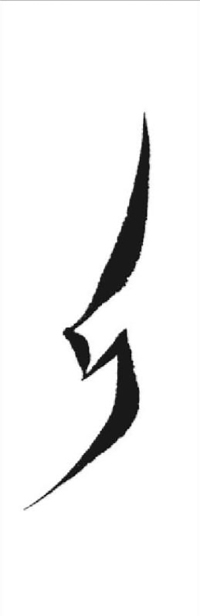 | 75 | 主爪己几纪举缴 | tci35 |  |
| 75 | U+01b1bb | 𛆻 |  | 111 | 彻喜枕种肿紧锦少起砌 | ci35 |  |
| 76 | U+01b1bc | 𛆼 |  | 76 | 一以叶 | i5 |  |
| 77 | U+01b1bd | 𛆽 |  | 77 | 猪绿料旅驴 | liu44 |  |
| 78 | U+01b1be | 𛆾 |  | 78 | 尿 | njiu33 |  |
| 79 | U+01b1bf | 𛆿 |  | 79 | 少稍 | ciu35 |  |
| 80 | U+01b1c0 | 𛇀 |  | 80 | 母马木目墓麦磨麻亩牡 | mu13 |  |
| 81 | U+01b1c1 | 𛇁 |  | 81 | 拿夜又也右佑亦忧要匀若 | yu44 |  |
| 82 | U+01b1c2 | 𛇂 | 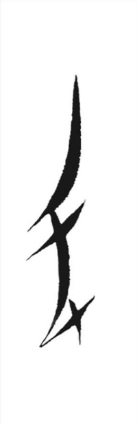 | 82 | 翠去趣欺取娶区 | tchy21 |  |
| 83 | U+01b1c3 | 𛇃 |  | 83 | 月遇外 | njy33 |  |
| 84 | U+01b1c4 | 𛇄 |  | 84 | 余移欲愚与入如 | y42 |  |
| 85 | U+01b1c5 | 𛇅 |  | 85 | 本表 | pai35 |  |
| 86 | U+01b1c6 | 𛇆 |  | 89 | 惭正帐政转整诊拯镜敬竟卷眷京惊渐颈景井警 | pai35 |  |
| 87 | U+01b1c7 | 𛇇 |  | 87 | 怜林淋麟劳僚 | lai42 |  |
| 88 | U+01b1c8 | 𛇈 |  | 86 | 日入儿而尔恩 | ai42 |  |
| 89 | U+01b1c9 | 𛇉 |  | 88 | 口肯好搞 | hau35 |  |
| 90 | U+01b1ca | 𛇊 |  | 90 | 脑投头套 | tou42 |  |
| 91 | U+01b1cb | 𛇋 |  | 91 | 柳流留刘榴溜 | liou42 |  |
| 92 | U+01b1cc | 𛇌 |  | 92 | 后後 | iou13 |  |
| 93 | U+01b1cd | 𛇍 |  | 94 | 作左 | tsew35 |  |
| 94 | U+01b1ce | 𛇎 |  | 93 | 坐做作综 | tsew21 |  |
| 95 | U+01b1cf | 𛇏 |  | 95 | 生山甥牲笙衫梭馊腮 | suow44 |  |
| 96 | U+01b1d0 | 𛇐 |  | 97 | 行闲相杏限幸还衡烦 | huow42 |  |
| 97 | U+01b1d1 | 𛇑 |  | 96 | 反 | huow35 |  |
| 98 | U+01b1d2 | 𛇒 |  | 148 | 外稳 | nguw33 |  |
| 99 | U+01b1d3 | 𛇓 |  | 98 | 眉忙茫蒙盲瞒迷眯蛮 | mang42 |  |
| 100 | U+01b1d4 | 𛇔 |  | 101 | 汤 | thang44 |  |
| 101 | U+01b1d5 | 𛇕 | 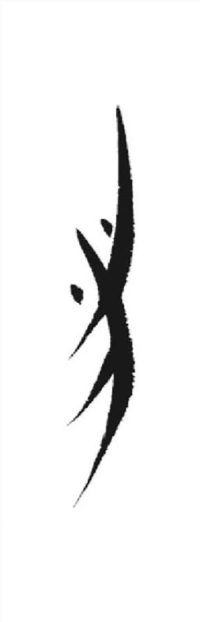 | 99 | 间减烘光官刚功肝冠钢干冈甘棺岗缸柑观公关馆赶敢管感广杆 | kang44 |  |
| 102 | U+01b1d6 | 𛇖 |  | 100 | 亮谅量 | liang33 |  |
| 103 | U+01b1d7 | 𛇗 | 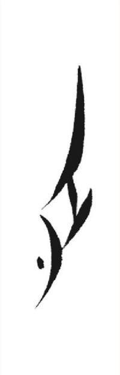 | 102 | 长撑掌讲 | tciang35 |  |
| 104 | U+01b1d8 | 𛇘 |  | 103 | 娘 | njiang42 |  |
| 105 | U+01b1d9 | 𛇙 |  | 105 | 便边鞭辫片偏 | peng44 |  |
| 106 | U+01b1da | 𛇚 |  | 104 | 先仙鲜 | seng44 |  |
| 107 | U+01b1db | 𛇛 |  | 107 | 丙评平瓶 | piong42 |  |
| 108 | U+01b1dc | 𛇜 |  | 106 | 听 | tshiong21 |  |
| 109 | U+01b1dd | 𛇝 |  | 108 | 占见建敬件 | tcing21 |  |
| 110 | U+01b1de | 𛇞 |  | 109 | 笔 | pa5 |  |
| 111 | U+01b1df | 𛇟 |  | 110 | 知立泪虑厉利笠雷 | la33 |  |
| 112 | U+01b1e0 | 𛇠 |  | 123 | 此齿刺次写些伞省且 | sie35 |  |
| 113 | U+01b1e1 | 𛇡 |  | 394 | 毑 | tcie35 |  |
| 114 | U+01b1e2 | 𛇢 |  | 395 | 个派 | ie21 | 无图片 |
| 115 | U+01b1e3 | 𛇣 |  | 113 | 报被拜摆跛败拔沸皮 | poe21 |  |
| 116 | U+01b1e4 | 𛇤 | 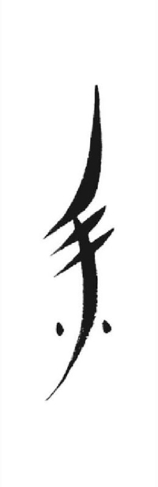 | 115 | 来 | loe42 |  |
| 117 | U+01b1e5 | 𛇥 |  | 116 | 在再载债灾栽 | tsoe13 |  |
| 118 | U+01b1e6 | 𛇦 |  | 117 | 采插踩煞杀刹死 | soe5 |  |
| 119 | U+01b1e7 | 𛇧 |  | 118 | 揩街阶皆架价嫁介乖该改盖告怪 | koe44 |  |
| 120 | U+01b1e8 | 𛇨 |  | 119 | 快块 | khuoe21 |  |
| 121 | U+01b1e9 | 𛇩 |  | 120 | 忧夜运野益闰惹弱 | ye21 |  |
| 122 | U+01b1ea | 𛇪 |  | 121 | 把白吧便变拍培 | pwe33 |  |
| 123 | U+01b1eb | 𛇫 |  | 122 | 百佰柏北拔拨缽迫拍泼 | pwe5 |  |
| 124 | U+01b1ec | 𛇬 |  | 124 | 既气弃契 | tchi21 |  |
| 125 | U+01b1ed | 𛇭 |  | 125 | 除厨住柱助足聚樵 | tsiu33 |  |
| 126 | U+01b1ee | 𛇮 |  | 126 | 鞋和何蝴荷胡豪毫耗芙扶 | fu42 |  |
| 127 | U+01b1ef | 𛇯 |  | 129 | 嬷禾和雨鹅无武乌 | vu42 |  |
| 128 | U+01b1f0 | 𛇰 |  | 127 | 苦枯虎湖古果鼓股故过固 | khu35 |  |
| 129 | U+01b1f1 | 𛇱 |  | 128 | 哭屋 | hu5 |  |
| 130 | U+01b1f2 | 𛇲 |  | 130 | 拨背杯变卜霸妇陪拍怕帕配赔聘 | pw13 |  |
| 131 | U+01b1f3 | 𛇳 |  | 131 | 华回费 | fw42 |  |
| 132 | U+01b1f4 | 𛇴 |  | 135 | 曾侄色塞是始使适宿 | sw5 |  |
| 133 | U+01b1f5 | 𛇵 | 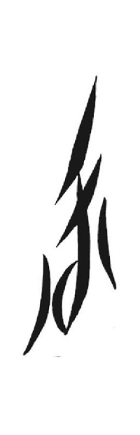 | 132 | 滑葛割物 | kw5 |  |
| 134 | U+01b1f6 | 𛇶 |  | 133 | 开孩害 | hw44 |  |
| 135 | U+01b1f7 | 𛇷 |  | 134 | 门民毛眉闻 | mai42 |  |
| 136 | U+01b1f8 | 𛇸 |  | 136 | 吞 | thai44 |  |
| 137 | U+01b1f9 | 𛇹 |  | 137 | 辛心新森 | sai44 |  |
| 138 | U+01b1fa | 𛇺 |  | 138 | 悯心新 | sai44 |  |
| 139 | U+01b1fb | 𛇻 |  | 139 | 讨 | thau35 |  |
| 140 | U+01b1fc | 𛇼 |  | 140 | 老到倒斗道稻凳汪 | lau21 |  |
| 141 | U+01b1fd | 𛇽 | 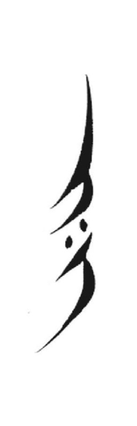 | 112 | 老到凳 | lau21 |  |
| 142 | U+01b1fe | 𛇾 |  | 114 | 明名鸣哪抛 | nou33 |  |
| 143 | U+01b1ff | 𛇿 | 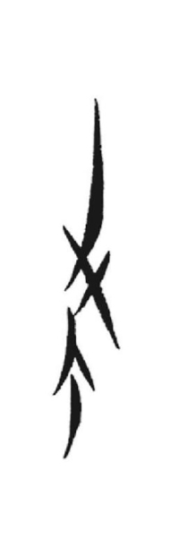 | 141 | 阁搁罐 | kou33 |  |
| 144 | U+01b200 | 𛈀 |  | 142 | 休收岸 | ciou44 |  |
| 145 | U+01b201 | 𛈁 |  | 143 | 吵所锁 | sew35 |  |
| 146 | U+01b202 | 𛈂 |  | 144 | 落洛丹多单 | lew44 |  |
| 147 | U+01b203 | 𛈃 |  | 145 | 炭 | thuow21 |  |
| 148 | U+01b204 | 𛈄 |  | 146 | 万湾弯 | uow33 |  |
| 149 | U+01b205 | 𛈅 |  | 147 | 甲嘉价国隔格寡股果滚 | kuw5 |  |
| 150 | U+01b206 | 𛈆 |  | 149 | 传程呈缠全权泉乾拳 | tcyn42 |  |
| 151 | U+01b207 | 𛈇 | 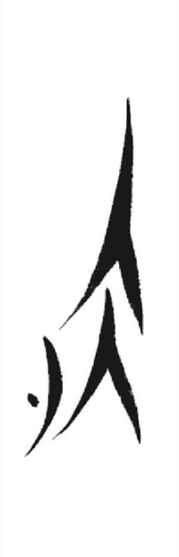 | 150 | 映院苑影 | yn35 |  |
| 152 | U+01b208 | 𛈈 |  | 151 | 忘望枉妄汪 | vang33 |  |
| 153 | U+01b209 | 𛈉 |  | 152 | 床藏庄妆装宗桩状撞浅 | tsang44 |  |
| 154 | U+01b20a | 𛈊 |  | 153 | 栅双霜桑酸丧 | sang44 |  |
| 155 | U+01b20b | 𛈋 |  | 155 | 孔 | khang35 |  |
| 156 | U+01b20c | 𛈌 |  | 154 | 中章终张忠专涨樟江姜疆恭宫刚钢公共供弓 | tciang44 |  |
| 157 | U+01b20d | 𛈍 |  | 156 | 用养样央让 | iang13 |  |
| 158 | U+01b20e | 𛈎 |  | 157 | 垫田 | teng42 |  |
| 159 | U+01b20f | 𛈏 |  | 158 | 念闹怒哪内侬炼练联验砚艳研 | neng33 |  |
| 160 | U+01b210 | 𛈐 | 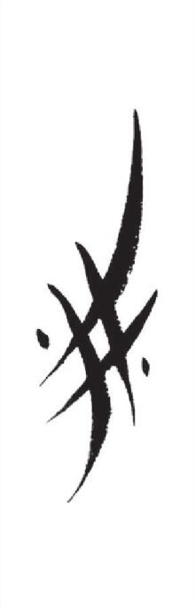 | 159 | 病兵篇拼 | piong33 |  |
| 161 | U+01b211 | 𛈑 |  | 160 | 命 | miong33 |  |
| 162 | U+01b212 | 𛈒 |  | 161 | 成城诚船悬凡盛 | ciong42 |  |
| 163 | U+01b213 | 𛈓 |  | 162 | 圣 | ciong21 |  |
| 164 | U+01b214 | 𛈔 |  | 163 | 言然 | njing42 |  |
| 165 | U+01b215 | 𛈕 |  | 164 | 暗案邀颜岩硬五碗我位 | ng13 |  |
| 166 | U+01b216 | 𛈖 |  | 165 | 早姊走澡盏者 | tsa35 |  |
| 167 | U+01b217 | 𛈗 |  | 166 | 四散晒瘦扫 | sa21 |  |
| 168 | U+01b218 | 𛈘 |  | 167 | 归规龟关 | kua44 |  |
| 169 | U+01b219 | 𛈙 |  | 168 | 鬼癸诡 | kua35 |  |
| 170 | U+01b21a | 𛈚 | 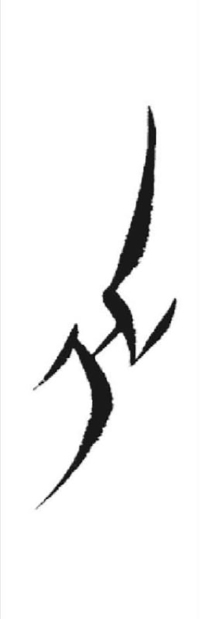 | 59 | 出 | cya5 |  |
| 171 | U+01b21b | 𛈛 |  | 170 | 兴申身深升伸剩 | cie44 |  |
| 172 | U+01b21c | 𛈜 |  | 171 | 派 | phoe35 |  |
| 173 | U+01b21d | 𛈝 |  | 172 | 怀 | foe42 |  |
| 174 | U+01b21e | 𛈞 |  | 173 | 辣俫 | loe35 |  |
| 175 | U+01b21f | 𛈟 |  | 182 | 猜差 | tshoe44 |  |
| 176 | U+01b220 | 𛈠 |  | 174 | 菜蔡 | tshoe21 |  |
| 177 | U+01b221 | 𛈡 |  | 175 | 衣 | oe44 |  |
| 178 | U+01b222 | 𛈢 | 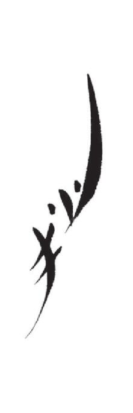 | 211 | 扯蠢托拖牵 | tchye35 |  |
| 179 | U+01b223 | 𛈣 |  | 176 | 蝦夏花话灰悔画 | fwe44 |  |
| 180 | U+01b224 | 𛈤 |  | 177 | 自字之枝脂姿滋兹支只贼制则寺 | tswe33 |  |
| 181 | U+01b225 | 𛈥 |  | 169 | 逆孽泥业热 | ni33 |  |
| 182 | U+01b226 | 𛈦 | 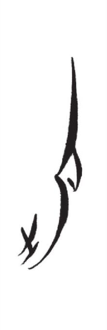 | 178 | 切 | tshi5 |  |
| 183 | U+01b227 | 𛈧 | 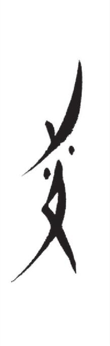 | 179 | 妾 | tshi5 |  |
| 184 | U+01b228 | 𛈨 |  | 180 | 西犀消肖宵逍毫妻凄 | si44 |  |
| 185 | U+01b229 | 𛈩 |  | 181 | 合喝服伏付赴务 | fu33 |  |
| 186 | U+01b22a | 𛈪 |  | 183 | 我瓦 | ngu13 |  |
| 187 | U+01b22b | 𛈫 |  | 185 | 处 | tchyu21 |  |
| 188 | U+01b22c | 𛈬 |  | 184 | 书输舒树赎粟 | cyu44 |  |
| 189 | U+01b22d | 𛈭 |  | 186 | 譬佩迫配 | phw21 |  |
| 190 | U+01b22e | 𛈮 |  | 187 | 魂坟 | fai42 |  |
| 191 | U+01b22f | 𛈯 |  | 188 | 长重皂尽进祭讲 | tsai13 |  |
| 192 | U+01b230 | 𛈰 | 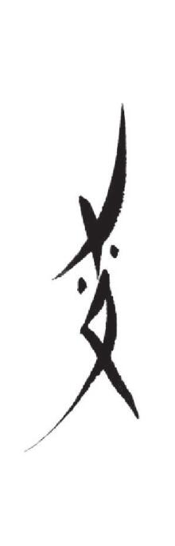 | 189 | 牛楼劳 | lou42 |  |
| 193 | U+01b231 | 𛈱 |  | 192 | 座浊昨作 | tsou5 |  |
| 194 | U+01b232 | 𛈲 |  | 190 | 包胞剥饱抛 | piou44 |  |
| 195 | U+01b233 | 𛈳 |  | 191 | 茅卯苗酉 | miou13 |  |
| 196 | U+01b234 | 𛈴 |  | 193 | 臭 | tchiou21 |  |
| 197 | U+01b235 | 𛈵 |  | 194 | 肉 | njiou33 |  |
| 198 | U+01b236 | 𛈶 |  | 195 | 酉有友幼与 | iou13 |  |
| 199 | U+01b237 | 𛈷 |  | 198 | 难能 | nuow42 |  |
| 200 | U+01b238 | 𛈸 |  | 197 | 间更耕 | kuow44 |  |
| 201 | U+01b239 | 𛈹 |  | 196 | 喊 | huow21 |  |
| 202 | U+01b23a | 𛈺 | 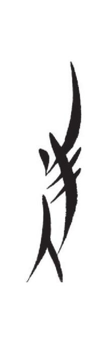 | 200 | 半般帮搬伴啄饭放判胖 | pang44 |  |
| 203 | U+01b23b | 𛈻 |  | 202 | 你恼 | ang21 |  |
| 204 | U+01b23c | 𛈼 |  | 205 | 像相纵丈将浆蒋匠 | tsiang44 |  |
| 205 | U+01b23d | 𛈽 |  | 204 | 长从详祥墙 | tsiang42 |  |
| 206 | U+01b23e | 𛈾 |  | 199 | 暖常尝偿雄熊裳 | ciang42 |  |
| 207 | U+01b23f | 𛈿 |  | 206 | 阳羊杨扬洋容蓉绒融 | iang42 |  |
| 208 | U+01b240 | 𛉀 |  | 209 | 宁灵零龄论 | liong42 |  |
| 209 | U+01b241 | 𛉁 |  | 207 | 请 | tshiong35 |  |
| 210 | U+01b242 | 𛉂 | 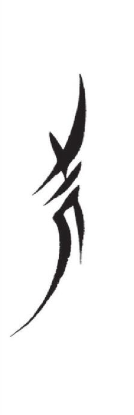 | 208 | 兄声 | ciong44 |  |
| 211 | U+01b243 | 𛉃 | 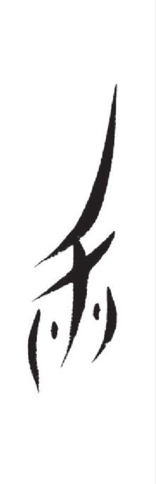 | 210 | 显险掀现扇 | cing35 |  |
| 212 | U+01b244 | 𛉄 |  | 212 | 里理鲤李履懒裹旦 | la13 |  |
| 213 | U+01b245 | 𛉅 |  | 213 | 垂婿卷谁诉数睡述随虽 | cya42 |  |
| 214 | U+01b246 | 𛉆 |  | 214 | 排匹 | poe42 |  |
| 215 | U+01b247 | 𛉇 |  | 216 | 胎 | thoe44 |  |
| 216 | U+01b248 | 𛉈 |  | 215 | 哪奈耐挪 | noe33 |  |
| 217 | U+01b249 | 𛉉 | 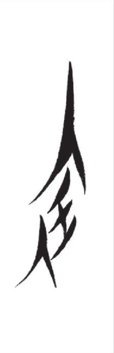 | 271 | 钗差缠卷捐乾 | tshoe44 |  |
| 218 | U+01b24a | 𛉊 |  | 217 | 宅助家加佳瓜 | kue44 |  |
| 219 | U+01b24b | 𛉋 |  | 218 | 假价驾寡 | kue35 |  |
| 220 | U+01b24c | 𛉌 |  | 219 | 揩嫁架价街皆阶挂怪卦乖 | kue21 |  |
| 221 | U+01b24d | 𛉍 |  | 220 | 爹云爷匀乌污 | ye42 |  |
| 222 | U+01b24e | 𛉎 | 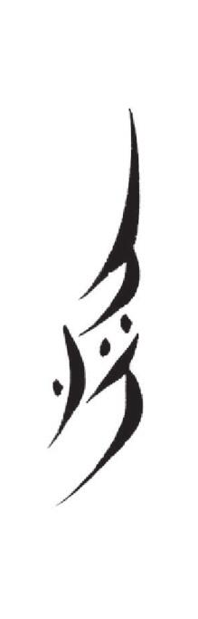 | 221 | 比彼把宝保板壁被婢摆榜扳 | pwe35 |  |
| 223 | U+01b24f | 𛉏 |  | 222 | 哑 | vwe35 |  |
| 224 | U+01b250 | 𛉐 |  | 224 | 铁踢贴 | thi5 |  |
| 225 | U+01b251 | 𛉑 |  | 226 | 层蚕采赠斋尽进调齐樵 | tsi42 |  |
| 226 | U+01b252 | 𛉒 |  | 225 | 残惨祭娇济秦齐 | tsi42 |  |
| 227 | U+01b253 | 𛉓 |  | 227 | 绪制照兆赵站植占注计记季寄跽继既叫及忌纪桂直 | tci21 |  |
| 228 | U+01b254 | 𛉔 |  | 228 | 照赵种记寄 | tci21 |  |
| 229 | U+01b255 | 𛉕 |  | 229 | 跳剃替 | tshiu21 |  |
| 230 | U+01b256 | 𛉖 |  | 230 | 步薄抱部玻晡布博补夫腹甫婆蒲破铺扑 | pu33 |  |
| 231 | U+01b257 | 𛉗 |  | 232 | 茶查锄搽 | tsu42 |  |
| 232 | U+01b258 | 𛉘 |  | 233 | 逼辣癞赖更顾告过故盖的推 | ku21 |  |
| 233 | U+01b259 | 𛉙 |  | 234 | 珠朱拄具 | tcyu44 |  |
| 234 | U+01b25a | 𛉚 |  | 235 | 玉欲窝往 | njyu33 |  |
| 235 | U+01b25b | 𛉛 |  | 236 | 处娶取岂启 | tchy35 |  |
| 236 | U+01b25c | 𛉜 |  | 237 | 北拔 | pw5 |  |
| 237 | U+01b25d | 𛉝 | 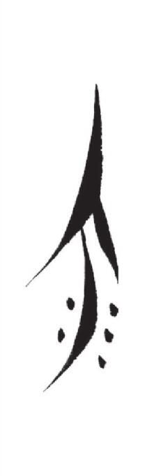 | 238 | 扯海害笋舍损耍舜捨 | hw35 |  |
| 238 | U+01b25e | 𛉞 |  | 239 | 品 | phai35 |  |
| 239 | U+01b25f | 𛉟 | 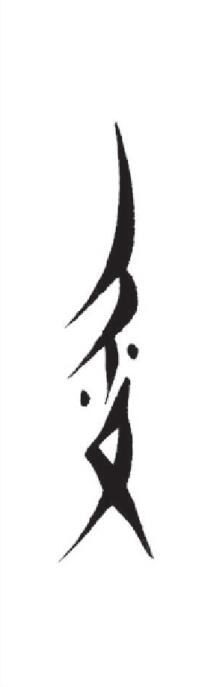 | 240 | 慢孟米莫麦每蜜眯庙妙买谋与问 | mai33 |  |
| 240 | U+01b260 | 𛉠 | 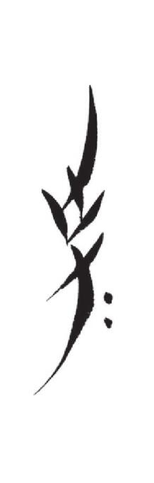 | 241 | 等 | lai35 |  |
| 241 | U+01b261 | 𛉡 |  | 242 | 信讯送宋 | sai21 |  |
| 242 | U+01b262 | 𛉢 |  | 243 | 红洪鸿 | hai42 |  |
| 243 | U+01b263 | 𛉣 |  | 245 | 冒帽 | mau33 |  |
| 244 | U+01b264 | 𛉤 |  | 244 | 草吵炒楚套 | tshau35 |  |
| 245 | U+01b265 | 𛉥 |  | 300 | 号 | hau33 |  |
| 246 | U+01b266 | 𛉦 |  | 246 | 喝个各阁搁恶 | kou5 |  |
| 247 | U+01b267 | 𛉧 |  | 302 | 欧 | ou44 |  |
| 248 | U+01b268 | 𛉨 |  | 247 | 绸袖总坤就共 | tsiou33 |  |
| 249 | U+01b269 | 𛉩 |  | 248 | 畜秋 | tshiou44 |  |
| 250 | U+01b26a | 𛉪 |  | 249 | 羞修 | siou44 |  |
| 251 | U+01b26b | 𛉫 |  | 250 | 粥祝角觉 | tciou5 |  |
| 252 | U+01b26c | 𛉬 |  | 252 | 仇酬效校孝学寿受授熟 | ciou13 |  |
| 253 | U+01b26d | 𛉭 |  | 253 | 通滩 | thuow44 |  |
| 254 | U+01b26e | 𛉮 |  | 254 | 奉放 | fang13 |  |
| 255 | U+01b26f | 𛉯 |  | 255 | 窝亡枉 | vang5 |  |
| 256 | U+01b270 | 𛉰 | 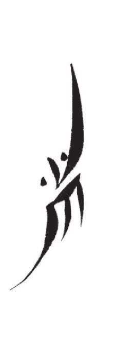 | 256 | 当端 | lang44 |  |
| 257 | U+01b271 | 𛉱 |  | 257 | 聪窗餐仓苍葬枪迁腔抢 | tshang44 |  |
| 258 | U+01b272 | 𛉲 |  | 259 | 空康宽堪 | khang44 |  |
| 259 | U+01b273 | 𛉳 |  | 258 | 砍 | khang5 |  |
| 260 | U+01b274 | 𛉴 |  | 260 | 良粮龙凉梁粱隆亮量 | liang42 |  |
| 261 | U+01b275 | 𛉵 |  | 203 | 凑相箱镶湘厢松 | siang44 |  |
| 262 | U+01b276 | 𛉶 |  | 261 | 香乡胸伤商尚 | ciang44 |  |
| 263 | U+01b277 | 𛉷 |  | 314 | 响享 | ciang35 |  |
| 264 | U+01b278 | 𛉸 |  | 262 | 念点典 | neng35 |  |
| 265 | U+01b279 | 𛉹 |  | 263 | 线连莲 | leng42 |  |
| 266 | U+01b27a | 𛉺 | 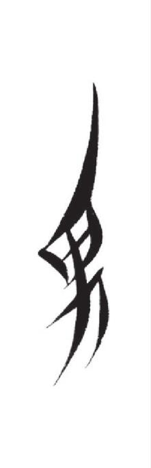 | 264 | 男南 | nong42 |  |
| 267 | U+01b27b | 𛉻 | 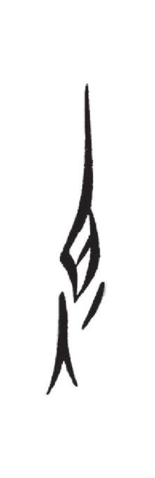 | 265 | 胆但担坦 | long35 |  |
| 268 | U+01b27c | 𛉼 |  | 266 | 宁冷岭领另令灵龄零丁钉 | liong13 |  |
| 269 | U+01b27d | 𛉽 |  | 267 | 静净精睛定 | tsiong13 |  |
| 270 | U+01b27e | 𛉾 |  | 269 | 参星姓性簪 | siong44 |  |
| 271 | U+01b27f | 𛉿 |  | 270 | 占经坚兼肩 | tcing44 |  |
| 272 | U+01b280 | 𛊀 |  | 272 | 缠展沾捡 | tcing44 |  |
| 273 | U+01b281 | 𛊁 |  | 273 | 贤嫌形刑 | cing42 |  |
| 274 | U+01b282 | 𛊂 |  | 274 | 你燕咽 | ing21 |  |
| 275 | U+01b283 | 𛊃 |  | 275 | 磨安鞍庵嗯饿碗误 | ng44 |  |
| 276 | U+01b284 | 𛊄 |  | 276 | 为唯围微违维伪 | va42 |  |
| 277 | U+01b285 | 𛊅 | 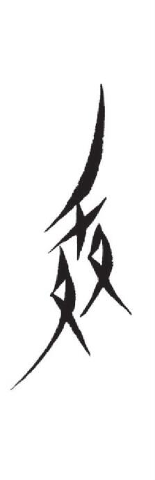 | 277 | 坐做作死 | sa35 |  |
| 278 | U+01b286 | 𛊆 |  | 278 | 雷 | lie42 |  |
| 279 | U+01b287 | 𛊇 |  | 279 | 退 | tshie21 |  |
| 280 | U+01b288 | 𛊈 |  | 280 | 昔惜锡积绩借 | sie5 |  |
| 281 | U+01b289 | 𛊉 | 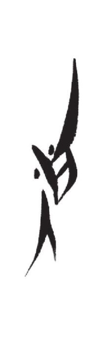 | 281 | 吃引应任我 | ie13 |  |
| 282 | U+01b28a | 𛊊 |  | 282 | 买嬷埋奶尾萎 | moe13 |  |
| 283 | U+01b28b | 𛊋 |  | 283 | 捉带 | loe21 |  |
| 284 | U+01b28c | 𛊌 |  | 284 | 春村车撑 | tchye44 |  |
| 285 | U+01b28d | 𛊍 |  | 223 | 靴逊训孙石顺射社舍赦笋停 | cye44 |  |
| 286 | U+01b28e | 𛊎 |  | 285 | 别离厘篱璃罗 | pi33 |  |
| 287 | U+01b28f | 𛊏 |  | 286 | 梯 | ti44 |  |
| 288 | U+01b290 | 𛊐 |  | 287 | 吸职折织执酌汁吉结急级击劫洁脚菊决 | tci5 |  |
| 289 | U+01b291 | 𛊑 |  | 297 | 皱焦蕉椒 | tsiu44 |  |
| 290 | U+01b292 | 𛊒 |  | 231 | 腹斧 | pu5 |  |
| 291 | U+01b293 | 𛊓 |  | 288 | 祸妇富附负 | fu21 |  |
| 292 | U+01b294 | 𛊔 |  | 289 | 土塔 | thu35 |  |
| 293 | U+01b295 | 𛊕 |  | 290 | 匣河喊 | hu42 |  |
| 294 | U+01b296 | 𛊖 |  | 291 | 著着惧借菌祀 | tcy13 |  |
| 295 | U+01b297 | 𛊗 |  | 292 | 雪血歇硕设识室 | cy5 |  |
| 296 | U+01b298 | 𛊘 |  | 293 | 逢浮朋陪贫蓬盆袍赔 | pw42 |  |
| 297 | U+01b299 | 𛊙 |  | 294 | 刻 | khw5 |  |
| 298 | U+01b29a | 𛊚 |  | 295 | 弄东灯登冬低 | lai44 |  |
| 299 | U+01b29b | 𛊛 |  | 296 | 辛心新 | sai44 |  |
| 300 | U+01b29c | 𛊜 |  | 299 | 产减省嫂伞 | sau35 |  |
| 301 | U+01b29d | 𛊝 | 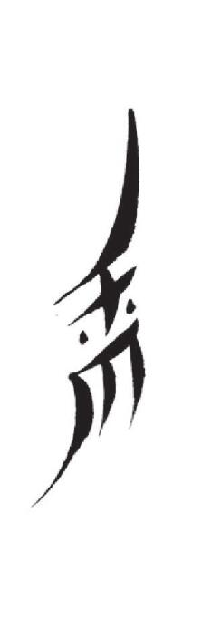 | 298 | 愁沉尘陈撑曹遭至志智制治种证镇禁髻似穷勤琴芹 | tsou42 |  |
| 302 | U+01b29e | 𛊞 |  | 301 | 牛 | ngou42 |  |
| 303 | U+01b29f | 𛊟 |  | 303 | 酒 | tsiou33 |  |
| 304 | U+01b2a0 | 𛊠 | 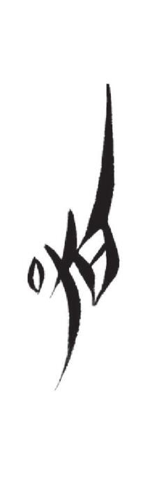 | 305 | 咬 | njiou13 |  |
| 305 | U+01b2a1 | 𛊡 |  | 304 | 法叔 | ciou5 |  |
| 306 | U+01b2a2 | 𛊢 |  | 251 | 鱼由游油犹尤衙牙芽渔柔娥鹅吴 | iou42 |  |
| 307 | U+01b2a3 | 𛊣 |  | 306 | 英 | yn44 |  |
| 308 | U+01b2a4 | 𛊤 |  | 307 | 迟地赏同堂团塘童棠唐谈桃萄逃统 | tang42 |  |
| 309 | U+01b2a5 | 𛊥 |  | 201 | 郎狼朗短党挡当端断栋 | lang42 |  |
| 310 | U+01b2a6 | 𛊦 |  | 311 | 广管敢感赶馆 | kang35 |  |
| 311 | U+01b2a7 | 𛊧 |  | 308 | 糠欢荒汉换焕汗唤翰旱 | hang44 |  |
| 312 | U+01b2a8 | 𛊨 |  | 309 | 行衔咸黄寒皇杭含韩烦 | hang42 |  |
| 313 | U+01b2a9 | 𛊩 | 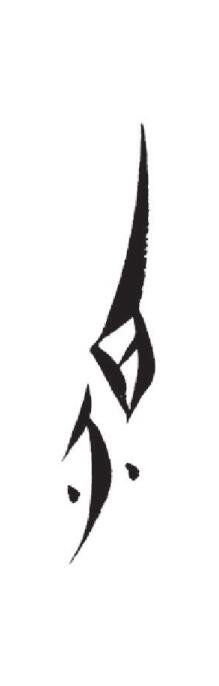 | 310 | 想响相恐抢 | siang35 |  |
| 314 | U+01b2aa | 𛊪 |  | 312 | 层长像象重丈仗种帐众奏皱灶皂造降颂 | tciang13 |  |
| 315 | U+01b2ab | 𛊫 |  | 313 | 鸳鸯秧英婴烟染 | iang44 |  |
| 316 | U+01b2ac | 𛊬 |  | 315 | 梅眠媒棉绵枚 | meng42 |  |
| 317 | U+01b2ad | 𛊭 |  | 268 | 停廷亭庭厅清情晴青 | tsiong42 |  |
| 318 | U+01b2ae | 𛊮 |  | 316 | 姓性幸犯岁鸭 | siong21 |  |
| 319 | U+01b2af | 𛊯 |  | 317 | 穿川轻卿倾 | tchiong44 |  |
| 320 | U+01b2b0 | 𛊰 |  | 318 | 悲碑被婢备避拔辈斑贝 | pa33 |  |
| 321 | U+01b2b1 | 𛊱 |  | 349 | 脱 | tshie5 |  |
| 322 | U+01b2b2 | 𛊲 |  | 319 | 惜昔肯恨憾 | sie5 |  |
| 323 | U+01b2b3 | 𛊳 |  | 320 | 灾斋 | tsoe44 |  |
| 324 | U+01b2b4 | 𛊴 |  | 321 | 解矮且 | koe35 |  |
| 325 | U+01b2b5 | 𛊵 |  | 322 | 尊遵诸遮军君均居闺裙 | tcye44 |  |
| 326 | U+01b2b6 | 𛊶 |  | 323 | 存巡膝袖竹罪最蔗尊炙转跨裤俊军郡裙 | tcye42 |  |
| 327 | U+01b2b7 | 𛊷 |  | 324 | 把 | pwe35 |  |
| 328 | U+01b2b8 | 𛊸 | 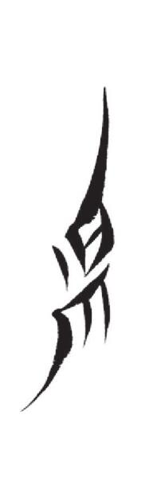 | 325 | 屎思司丝师诗私狮尸施斯恩 | swe44 |  |
| 329 | U+01b2b9 | 𛊹 |  | 326 | 啼提 | ti42 |  |
| 330 | U+01b2ba | 𛊺 |  | 327 | 移姨摇窑油游依 | i42 |  |
| 331 | U+01b2bb | 𛊻 |  | 335 | 朝场肠长重渐其墙桥茄乔骑奇旗期棋麒祁强 | tciu42 |  |
| 332 | U+01b2bc | 𛊼 |  | 336 | 痴稀希食烧岁失属输淑欺 | ciu44 |  |
| 333 | U+01b2bd | 𛊽 |  | 328 | 祖组阻赌 | tsu35 |  |
| 334 | U+01b2be | 𛊾 |  | 329 | 骂初粗差操鬚租宅助梳疏纱沙杉苏蓑蔬 | tshu35 |  |
| 335 | U+01b2bf | 𛊿 |  | 330 | 孤姑锅估改 | ku44 |  |
| 336 | U+01b2c0 | 𛋀 |  | 331 | 德得答 | lw5 |  |
| 337 | U+01b2c1 | 𛋁 |  | 332 | 门闻 | mai42 |  |
| 338 | U+01b2c2 | 𛋂 |  | 333 | 篮高糕篙哥孤勾钩沟稿敲 | kau44 |  |
| 339 | U+01b2c3 | 𛋃 |  | 334 | 兜透痛探偷贪滔 | thou21 |  |
| 340 | U+01b2c4 | 𛋄 |  | 342 | 候喊 | hou33 |  |
| 341 | U+01b2c5 | 𛋅 |  | 339 | 螃环房妨逢防纺访盘旁亡玩 | pang42 |  |
| 342 | U+01b2c6 | 𛋆 |  | 343 | 宾冰掰风妨封分份凭问 | fang44 |  |
| 343 | U+01b2c7 | 𛋇 |  | 340 | 断地段缎短端 | tang13 |  |
| 344 | U+01b2c8 | 𛋈 |  | 337 | 浪乱短党端断 | lang33 |  |
| 345 | U+01b2c9 | 𛋉 |  | 338 | 墨妹面免敏梅枚 | meng33 |  |
| 346 | U+01b2ca | 𛋊 |  | 341 | 殿电垫佃田恬填甜 | teng42 |  |
| 347 | U+01b2cb | 𛋋 |  | 344 | 贱尖箭严然前钱浅泉 | tseng42 |  |
| 348 | U+01b2cc | 𛋌 |  | 345 | 现善扇 | cing13 |  |
| 349 | U+01b2cd | 𛋍 | 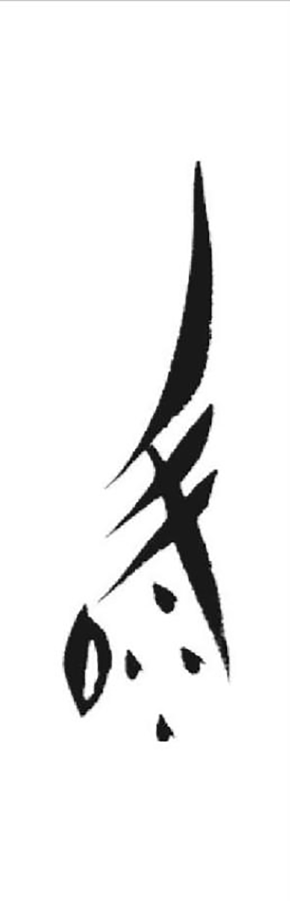 | 346 | 默蔫盈阎盐炎严赢郁抑迎忧延仍 | ing42 |  |
| 350 | U+01b2ce | 𛋎 | 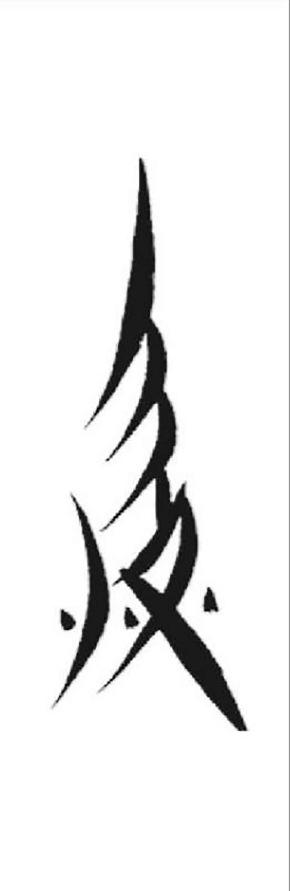 | 347 | 浸 | tsa33 |  |
| 351 | U+01b2cf | 𛋏 |  | 350 | 借 | tsie21 |  |
| 352 | U+01b2d0 | 𛋐 | 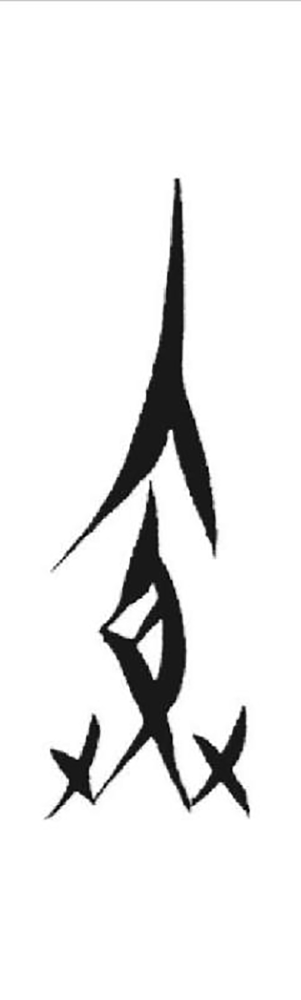 | 351 | 兴虚胜甚剩 | cie21 |  |
| 353 | U+01b2d1 | 𛋑 |  | 348 | 埋 | moe42 |  |
| 354 | U+01b2d2 | 𛋒 |  | 353 | 鸟煮底抵越体桶主 | li35 |  |
| 355 | U+01b2d3 | 𛋓 |  | 360 | 猫茅苗拆策直指摘责节接借截实 | tsi5 |  |
| 356 | U+01b2d4 | 𛋔 |  | 352 | 朝嬉招直值置蛰这娇鸡饥机基稽轿急及极忌寂居俱绝襟金闺麒 | tci44 |  |
| 357 | U+01b2d5 | 𛋕 |  | 354 | 倚椅依扰 | i35 |  |
| 358 | U+01b2d6 | 𛋖 |  | 355 | 莫 | mu33 |  |
| 359 | U+01b2d7 | 𛋗 |  | 357 | 路露禄腊芦炉卢庐鲁鸬掳妒都 | lu21 |  |
| 360 | U+01b2d8 | 𛋘 |  | 358 | 湖河胡壶 | hu42 |  |
| 361 | U+01b2d9 | 𛋙 |  | 362 | 辰承乘晨神树赎深丞绍殊竖 | cyu33 |  |
| 362 | U+01b2da | 𛋚 |  | 361 | 黑害 | hw5 |  |
| 363 | U+01b2db | 𛋛 | 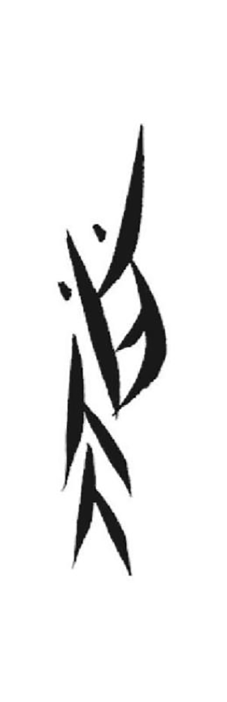 | 359 | 道稻豆 | tau13 |  |
| 364 | U+01b2dc | 𛋜 |  | 363 | 绣秀 | siou21 |  |
| 365 | U+01b2dd | 𛋝 |  | 365 | 落洛 | lew33 |  |
| 366 | U+01b2de | 𛋞 |  | 364 | 错 | tshew5 |  |
| 367 | U+01b2df | 𛋟 | 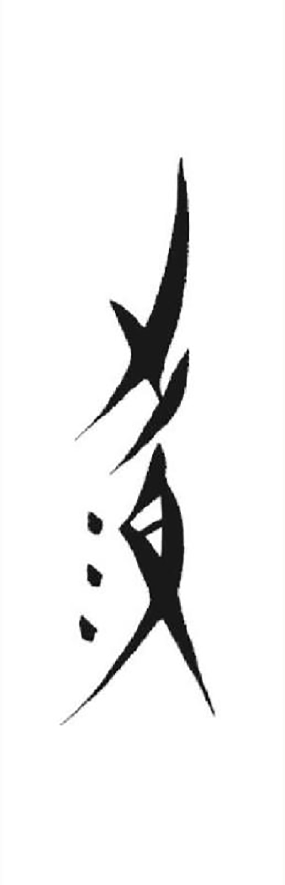 | 366 | 县远冤渊愿怨往 | yn13 |  |
| 368 | U+01b2e0 | 𛋠 |  | 367 | 淡潭 | tong13 |  |
| 369 | U+01b2e1 | 𛋡 |  | 368 | 吃饮隐 | ie35 |  |
| 370 | U+01b2e2 | 𛋢 | 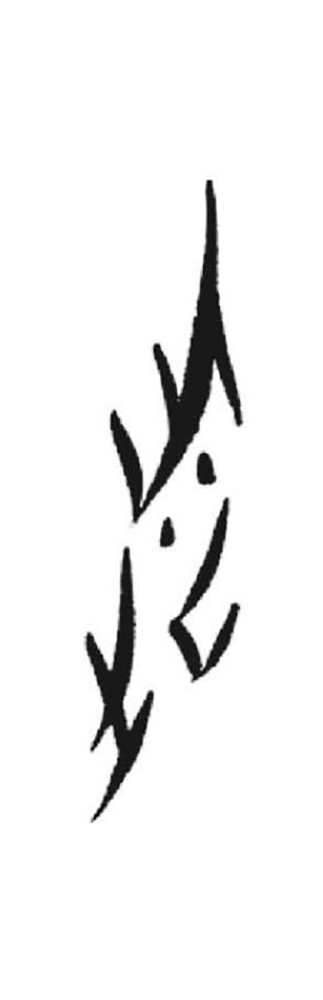 | 369 | 挖 | voe5 |  |
| 371 | U+01b2e3 | 𛋣 |  | 370 | 慈辞池持迟 | tswe21 |  |
| 372 | U+01b2e4 | 𛋤 |  | 371 | 既意以已 | i21 |  |
| 373 | U+01b2e5 | 𛋥 |  | 372 | 舂独毒达度渡窦肚读薯榻踏屠图 | tu33 |  |
| 374 | U+01b2e6 | 𛋦 |  | 356 | 堵赌 | lu35 |  |
| 375 | U+01b2e7 | 𛋧 |  | 373 | 乐漏兜蔸 | lou33 |  |
| 376 | U+01b2e8 | 𛋨 |  | 379 | 爱 | tsou42 |  |
| 377 | U+01b2e9 | 𛋩 |  | 374 | 争 | tsuow44 |  |
| 378 | U+01b2ea | 𛋪 |  | 375 | 美满梦摸摩蒙判胖网 | mang13 |  |
| 379 | U+01b2eb | 𛋫 |  | 378 | 总困贵挂怪跪更棍桂拐 | tciang33 |  |
| 380 | U+01b2ec | 𛋬 |  | 376 | 唱铳仗 | tchiang21 |  |
| 381 | U+01b2ed | 𛋭 |  | 377 | 正惊京荆精兢 | tciong44 |  |
| 382 | U+01b2ee | 𛋮 |  | 380 | 谢席夕阵借笛碟敌 | tsie33 |  |
| 383 | U+01b2ef | 𛋯 |  | 381 | 卖袜 | moe33 |  |
| 384 | U+01b2f0 | 𛋰 |  | 383 | 科考歌哥孤姑戈 | ku44 |  |
| 385 | U+01b2f1 | 𛋱 |  | 384 | 许主暑鼠 | cyu35 |  |
| 386 | U+01b2f2 | 𛋲 |  | 382 | 背 | pw21 |  |
| 387 | U+01b2f3 | 𛋳 |  | 385 | 沉从长层蚕辞曹巢陈曾昨遭僧 | tsiang42 |  |
| 388 | U+01b2f4 | 𛋴 |  | 386 | 葱踩抄操推妻亲侵凄 | tshai44 |  |
| 389 | U+01b2f5 | 𛋵 |  | 387 | 眼 | nguow13 |  |
| 390 | U+01b2f6 | 𛋶 | 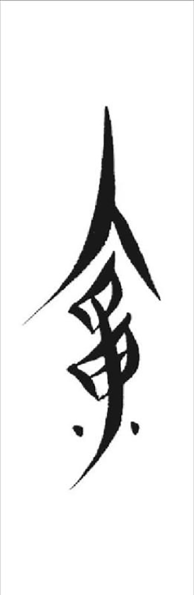 | 388 | 会活或话画悔患给佛罚范 | nong44 |  |
| 391 | U+01b2f7 | 𛋷 | 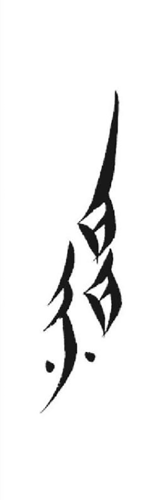 | 389 | 博忽福复幅腹斧魄 | fu5 |  |
| 392 | U+01b2f8 | 𛋸 |  | 390 | 谷穀鸽歌 | ku5 |  |
| 393 | U+01b2f9 | 𛋹 |  | 391 | 凤 | fang33 |  |
| 394 | U+01b2fa | 𛋺 | 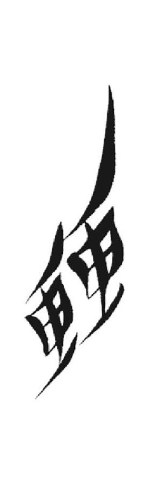 | 392 | 转渐眷 | tcye21 |  |
| 395 | U+01b2fb | 𛋻 |  | 393 | 费 | fi21 |  |
